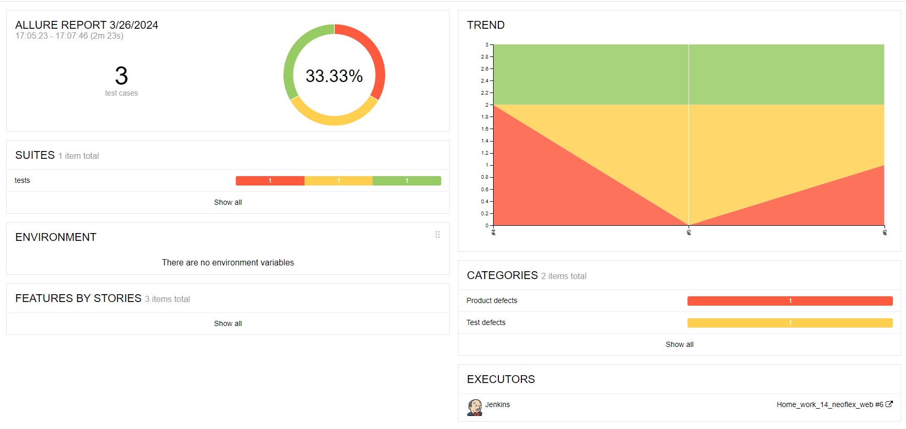
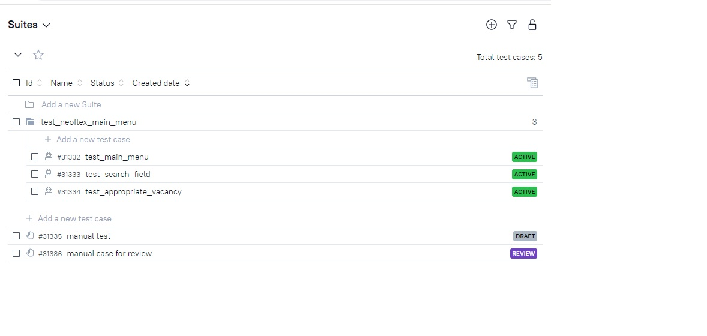
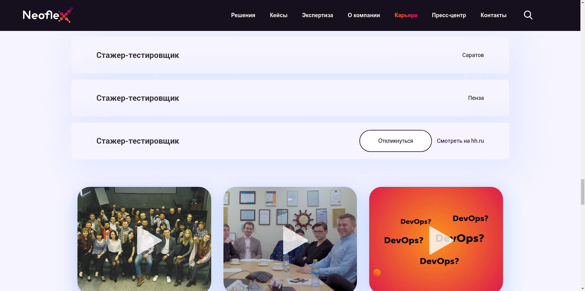
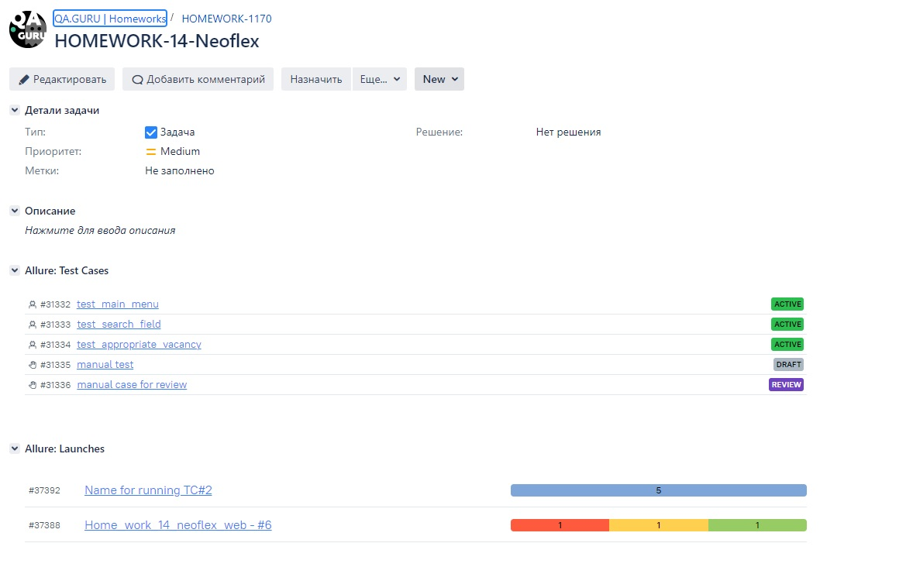
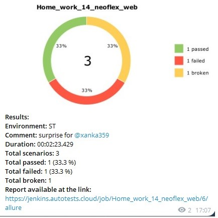

# Задание №14 

*** 
1. Выберите вакансию/сайт
2. Напишите на неё автотестов (5-10, простых, главное не тратьте на это много времени!)
3. Сделайте джобу в Jenkins, с запуском тестов в  Selenoid, добавьте Allure отчёт, уведомления в чат Telegram.
4. Оформите всё со скриншотами в readme.md
В поле ответа на задание приложите:
Ссылку на джобу в Jenkins, репозиторий с тестами на github, (скриншот письма рекрутёру).
Если вы не находитесь в поиске работы, просто сбросьте всё вышеуказанное на ревью. 
***  
### Выбран сайт [Neoflex](https://www.neoflex.ru/)

1. **Allure отчет**
  
___  

2. **Allure testops**
  
___  

3. **Screenshot from runnig**

___  

4. **Jira**  

___  

5. **Telegram**  

